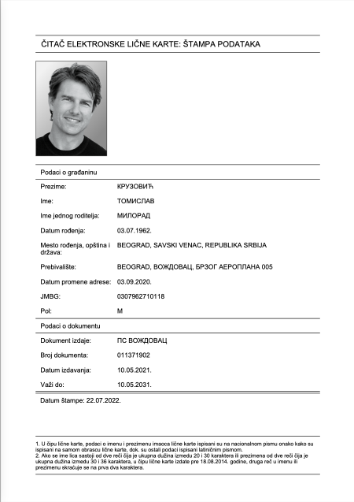

# Očitana lična karta

> 🤯 Očitati ličnu kartu lako, sada može baš svako.

+ 🚀 BEZ dodatnih uređaja!
+ ☕️ Potrebna samo Java.

...jer, to je samo PDF, na kraju.

## Brzo uputstvo

1. Položi ličnu kartu najdalje pedalj od računara; okrenutu prema najbližem MUP-u.
2. Popuni podatke u `licna.txt`.
3. Spremi crno-belu fotografiju u `licna.png`.
4. Pokreni: `./gradlew run`.

Očitana karta je snimljena kao `licna.pdf`.

## Detaljno uputstvo

### Popuni podatke u `licna.txt`

Na primer:
```dotenv
prezime=КРУЗОВИЋ
ime=ТОМИСЛАВ
roditelj=МИЛОРАД
rođendan=03.07.1962.
mesto-grad=BEOGRAD
mesto-opština=SAVSKI VENAC
mesto-država=REPUBLIKA SRBIJA
adresa-grad=BEOGRAD
adresa-opština=ВОЖДОВАЦ
adresa-ulica=БРЗОГ АЕРОПЛАНА 005
adresa-datum=03.09.2020.
jmbg=0307962710118
pol=M
izdao=ПС ВОЖДОВАЦ
broj=011371902
od=10.05.2021.
do=10.05.2031.
štampa=22.07.2022.
```
Datum se piše uvek u formatu: `DD.MM.YYYY.` (obrati pažnju na poslednju tačku iza godine.) Da, ćirilica i latinica se mešaju; najbolje slediti primer.

**Savet**: noviji telefoni su u mogućnosti da prepoznaju tekst sa uslikane lične karte. Tekst se, zatim, može lako prekopirati u fajl lako.

### Spremi crno-belu fotografiju u `licna.png`

Dimenzije fotografije treba da su u odnosu `visina:širina = 4:3`.

Fotografija treba da je crno-bela. Voditi računa da se NE ostavi bela ili prozirna pozadina; već napraviti jednostavnu sivu, gradijentnu pozadinu, da liči na onu sa fotke. Ukoliko dođete do originalne fotke, još bolje :)

### Pokreni `./gradlew run`

Na sistemu mora biti instalirana Java 11. Gornja komanda startuje program.

**Napomena**: prvo pokretanje programa traje značajno duže.

## Primer

[Lična karta Tomislava Kruzovića](licna.pdf)



💜